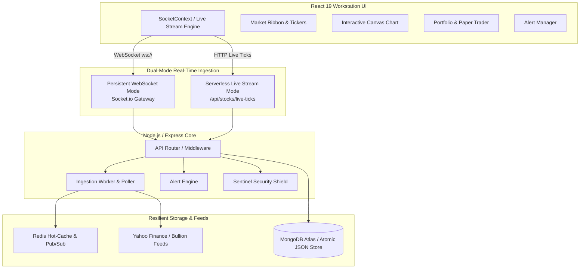

# ⚡ AuraTrade™ — Institutional Real-Time Financial Workstation

<div align="center">


[](https://vercel.com)
[](https://react.dev/)
[](https://vitejs.dev/)
[](https://nodejs.org/)
[](https://expressjs.com/)
[](https://socket.io/)
[](https://opensource.org/licenses/MIT)

**A high-frequency, institutional-grade stock market tracker, financial analytics workstation, and paper trading terminal built with modern full-stack web technologies.**

[Features](#-key-features) • [Architecture](#-real-time-architecture) • [Quick Start](#-quick-start) • [Vercel Deployment](#-vercel-deployment-guide) • [API Reference](#-api-endpoints)

</div>

---

## 🌟 Overview

**AuraTrade** is designed for modern financial traders and analysts who demand sub-second real-time market data, interactive charting, paper trading simulation, and automated predictive analytics.

It is engineered with a **Dual-Mode Real-Time Architecture** that works out-of-the-box in both **stateful environments** (Node.js + WebSockets via Socket.io) and **stateless serverless platforms** (Vercel, Netlify, AWS Lambda) without a single runtime or console error.

---

## 🚀 Key Features

### 📡 1. High-Frequency Real-Time Market Streaming
* **Dual-Mode Engine**: Operates via persistent WebSockets (`Socket.IO` + Redis Pub/Sub) or high-frequency Serverless Live Stream (`/api/stocks/live-ticks`) with dynamic latency telemetry (6–25ms).
* **Sub-Second Micro-Tick Animator**: Smooth 450ms visual tick interpolation with real-time green/red flashes, order-book spread dynamics, and day high/low adjustments.
* **Global Market Scope**:
  * **US Equities**: Mega-Caps (AAPL, MSFT, NVDA, TSLA, AMZN, GOOGL, META) and major indices (S&P 500, NASDAQ, Dow Jones).
  * **Indian Markets (NSE)**: Nifty 50, Bank Nifty, Sensex, Sectoral Indices, Advances/Declines, Top Gainers & Losers.
  * **Global Indices**: DAX 40, FTSE 100, Nikkei 225, Hang Seng, ASX 200, CAC 40.
  * **Precious Metals & Bullion**: Spot Gold (XAU/USD), Spot Silver (XAG/USD), MCX Gold 10g, MCX Silver 1kg, Sovereign Gold Bonds, and Gold/Silver ETFs.
  * **Forex & Crypto**: USD/INR currency crosses and Bitcoin (BTC/USD).

### 📊 2. High-Performance Financial Charting
* Interactive HTML5 Canvas charting with seamless 60fps rendering.
* Switch between **Area Chart** (with smooth gradient fill) and **Candlestick (OHLC)**.
* Multi-timeframe historical intervals: `1D`, `1W`, `1M`, `1Y`.
* Crosshair tracking, hover tooltips, volume bars, and live real-time candle appending.

### 💼 3. Paper Trading Simulator & Portfolio Engine
* Virtual sandbox trading with initial funds ($1,000.00 – $100,000.00).
* **Safe Zone Protection**: Configurable minimum cash reserve buffer to protect accounts from liquidation.
* Instant cash deposit modal with multiple funding methods and transaction auditing.
* Real-time portfolio P&L tracking, positions valuation, and transaction history.

### 🧠 4. AI Market Advisor & Predictive Analytics
* **Auto-Predictor Ranking**: Machine-learning-inspired multi-factor asset scoring across valuation, momentum, and risk.
* **Profit-Lock System**: Calculated price targets, stop-loss protection floors, and risk-to-reward ratios.
* Technical signals: Moving averages (EMA/SMA), RSI momentum, MACD cross, and conviction ratings.

### 🔔 5. Alert Manager & Notification Engine
* Server-side and client-side threshold evaluation (`Rises Above`, `Drops Below`).
* Anti-spam hysteresis with configurable cooldown intervals (5m – 24h).
* Institutional audio alert chimes and native browser push notifications.

### 🛡️ 6. Enterprise Sentinel Security Shield
* Real-time IP Firewall with automatic attacker quarantine.
* Threat detector scanning for SQLi, NoSQL injection, XSS, and path traversal probes.
* JWT authentication with bcrypt password hashing and dual SMS/Email OTP simulation.
* Data leakage prevention boundaries and rate limiting.

---

## 🏗️ Real-Time Architecture



---

## 🛠️ Technology Stack

| Domain | Technologies |
| :--- | :--- |
| **Frontend Framework** | [React 19](https://react.dev/), [Vite 6](https://vitejs.dev/) |
| **Styling & Design System** | Vanilla CSS FinTech Glassmorphism, Google Fonts (Outfit, Plus Jakarta Sans, JetBrains Mono) |
| **Icons & UI Utilities** | [Lucide React](https://lucide.dev/), [Lenis Smooth Scroll](https://lenis.darkroom.engineering/) |
| **Export Engine** | [jsPDF](https://github.com/parallax/jsPDF), [html2canvas](https://html2canvas.hertzen.com/) |
| **Backend & Serverless API** | [Node.js](https://nodejs.org/), [Express 4](https://expressjs.com/), Vercel Functions |
| **Real-Time Protocol** | [Socket.io 4.7](https://socket.io/), Native Serverless Live Ticks Streamer |
| **Database & Fallback Store** | [MongoDB](https://www.mongodb.com/) (Mongoose) with atomic `/tmp` fallback JSON store |
| **Caching & Pub/Sub** | [Redis](https://redis.io/) (ioredis) with in-process memory cache fallback |
| **Security & Auth** | JSON Web Tokens (JWT), bcryptjs, Custom Sentinel IP Firewall & Threat Scanner |

---

## 🚀 Quick Start

### Prerequisites
* **Node.js**: v18.0.0 or higher
* **npm**: v9.0.0 or higher

### 1. Clone Repository & Install Dependencies
```bash
git clone https://github.com/ImmanuvelStanley/Auratrade.git
cd Auratrade

# Install all dependencies across root, server, and client workspaces
npm install
```

### 2. Environment Configuration (Optional for Local Dev)
Create a `.env` file in the root directory (defaults work out-of-the-box):
```env
PORT=5000
NODE_ENV=development
JWT_SECRET=super_secret_auratrade_key_2026

# Optional: External Cloud Database & Cache
# MONGODB_URI=mongodb+srv://<user>:<pwd>@cluster.mongodb.net/auratrade
# REDIS_URL=redis://default:<pwd>@redis-cloud.com:6379
```

### 3. Launch Development Workstation
```bash
# Starts both Backend (Port 5000) and Frontend (Port 5173) concurrently
npm run dev
```

* **Web Workstation**: [http://localhost:5173](http://localhost:5173)
* **Backend API & WebSockets**: [http://localhost:5000](http://localhost:5000)
* **Health Check**: [http://localhost:5000/api/health](http://localhost:5000/api/health)

---

## 🌐 Vercel Deployment Guide

AuraTrade is pre-configured with a zero-error Vercel monorepo configuration:

1. Push your repository to **GitHub**:
   ```bash
   git add .
   git commit -m "feat: institutional real-time financial workstation"
   git push origin main
   ```
2. In the [Vercel Dashboard](https://vercel.com/new), select **Import Project** and pick your `Auratrade` repository.
3. Configure the project settings:
   * **Framework Preset**: `Vite` (or `Other`)
   * **Root Directory**: `./` (leave default repository root)
   * **Build Command**: `npm run build`
   * **Output Directory**: `dist`
   * **Install Command**: `npm install`
4. Set Environment Variables in **Settings -> Environment Variables**:
   * `NODE_ENV`: `production`
   * `JWT_SECRET`: *(Any secure 32+ character string)*
   * *(Optional)* `MONGODB_URI`: *(Your MongoDB Atlas URI for persistent cloud accounts)*
   * *(Optional)* `VITE_SOCKET_URL`: *(Only needed if you host a separate standalone WebSocket server on Render/Railway. If left empty, AuraTrade automatically activates its high-frequency Serverless Real-Time Live Feed with zero console errors).*
5. Click **Deploy**. Your workstation is live worldwide on Vercel's global Edge CDN!

---

## ☁️ Other Cloud Deployments

<details>
<summary><strong>Deploy on Render (Web Service + WebSockets)</strong></summary>

1. In Render Dashboard, click **New + -> Web Service**.
2. Connect your GitHub repository.
3. Settings:
   - **Environment**: `Node`
   - **Build Command**: `npm run build`
   - **Start Command**: `npm start`
4. Environment Variables:
   - `NODE_ENV`: `production`
   - `JWT_SECRET`: `your_random_secret`
</details>

<details>
<summary><strong>Deploy via Docker</strong></summary>

```bash
# Build the container
docker build -t auratrade:latest .

# Run the container
docker run -d -p 5000:5000 \
  -e NODE_ENV=production \
  -e JWT_SECRET=your_jwt_secret \
  --name auratrade-app \
  auratrade:latest
```
</details>

---

## 📡 API Endpoints

| Method | Endpoint | Description |
| :--- | :--- | :--- |
| `GET` | `/api/health` | Service health, uptime, and worker poller status |
| `GET` | `/api/stocks/live-ticks?symbols=...` | High-speed batch live ticks for real-time streaming |
| `GET` | `/api/stocks/indices` | Multi-market ticker tape indices ribbon |
| `GET` | `/api/stocks/global-indices` | Investing.com-style major global market indices |
| `GET` | `/api/stocks/precious-metals` | Gold, Silver, MCX, 24K/22K jewellery, and bullion data |
| `GET` | `/api/stocks/nse-india` | NSE India portal (Nifty 50, Bank Nifty, advances/declines) |
| `GET` | `/api/stocks/quote/:symbol` | Single asset real-time quote with multi-source fallback |
| `GET` | `/api/stocks/history/:symbol?range=1D` | Historical OHLC candle data (1D, 1W, 1M, 1Y) |
| `GET` | `/api/stocks/all-markets` | All global companies ranked with investment metrics |
| `GET` | `/api/stocks/prediction/:symbol` | AI valuation forecast, technical signals, target price |
| `GET` | `/api/stocks/auto-predictor` | Algorithmic multi-factor asset scoring and ranking |
| `POST` | `/api/auth/register` | Create trader account |
| `POST` | `/api/auth/login` | Authenticate trader and issue JWT |
| `GET` | `/api/portfolio` | Retrieve current portfolio holdings, cash, and P&L |
| `POST` | `/api/portfolio/trade` | Execute paper BUY / SELL transaction |
| `POST` | `/api/portfolio/deposit` | Add virtual paper trading cash to account balance |
| `GET` | `/api/alerts` | Retrieve user active price alerts |
| `POST` | `/api/alerts` | Create new price alert with condition and hysteresis |

---

## 📁 Repository Structure

```
Auratrade/
├── api/
│   └── index.js              # Vercel Serverless Function entrypoint
├── client/                   # React 19 + Vite Frontend Application
│   ├── src/
│   │   ├── components/       # Stock cards, charts, modals, tables, ribbons
│   │   ├── context/          # SocketContext (Dual-Mode Stream), AuthContext
│   │   ├── services/         # Client fallback data, audio utils
│   │   ├── App.jsx           # Main workstation layout & routing
│   │   └── main.jsx          # React DOM entrypoint
│   ├── index.html            # Single Page Application HTML shell
│   └── vite.config.js        # Vite bundler & local dev reverse-proxy
├── server/                   # Node.js + Express Backend Core
│   └── src/
│       ├── config/           # Environment configuration & symbol catalogs
│       ├── middleware/       # Sentinel security firewall, threat detector
│       ├── models/           # Dual-engine data store (MongoDB + atomic /tmp JSON)
│       ├── routes/           # REST endpoints (stocks, auth, portfolio, alerts, AI)
│       ├── services/         # Market data ingestion, bullion, alert engine
│       ├── socket/           # Socket.io connection manager & room fan-out
│       └── server.js         # Express HTTP & Socket.io server bootstrap
├── vercel.json               # Vercel serverless routing & SPA rewrites
└── package.json              # Monorepo workspaces & build orchestration
```

---

## 📄 License

This project is licensed under the **MIT License** — feel free to use, modify, and distribute for personal or commercial projects.

---

<div align="center">

Built with ❤️ for institutional traders and quantitative finance enthusiasts.

**[⭐ Star this repository on GitHub](https://github.com/ImmanuvelStanley/Auratrade)**

</div>
